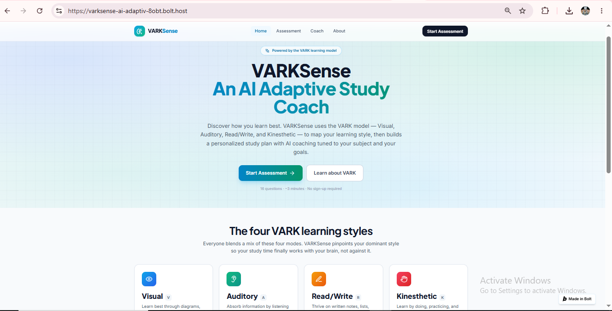
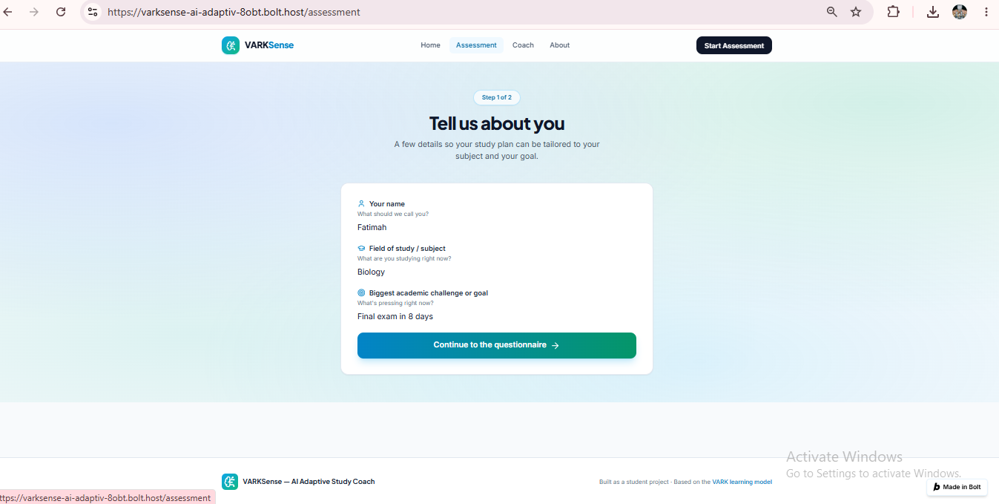
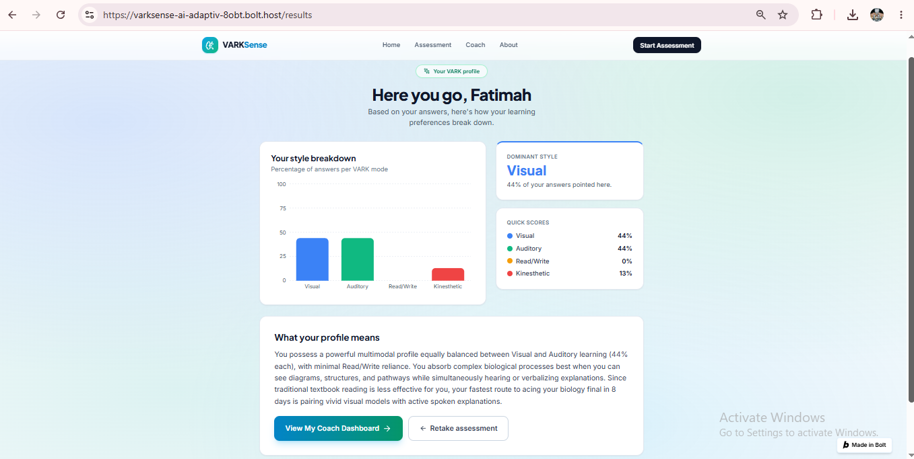
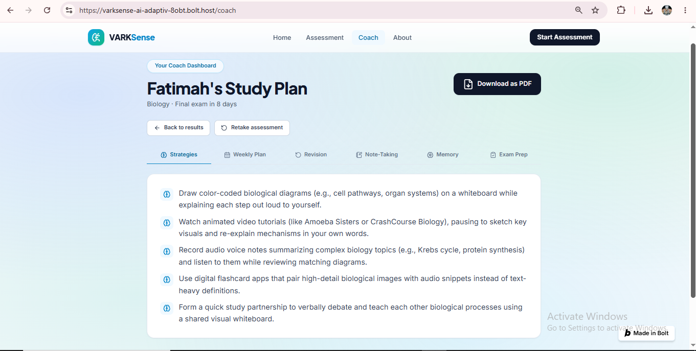
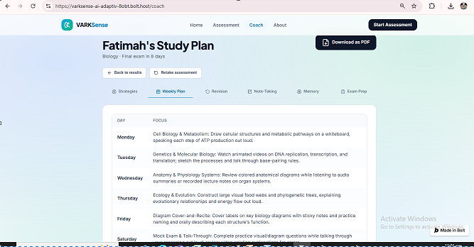
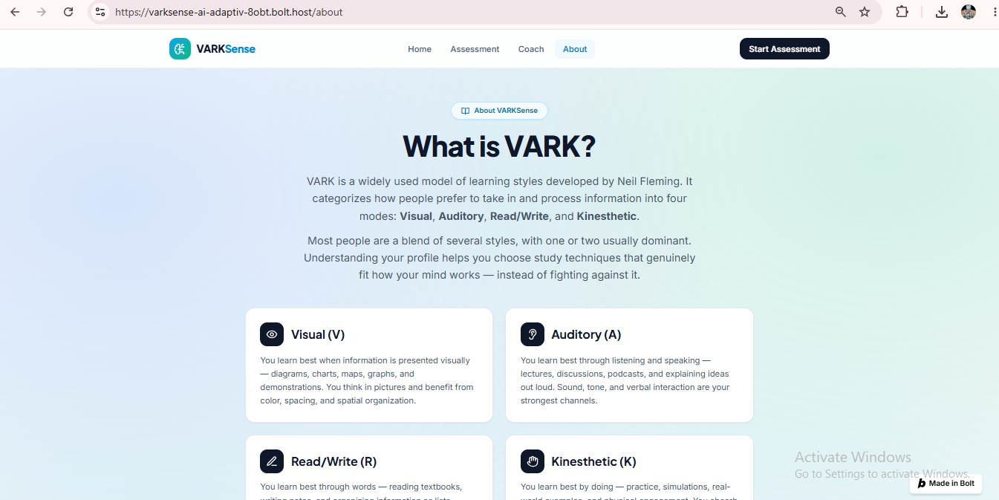

# VARKSense — An AI Adaptive Study Coach

## a. What it does & the problem it solves

**VARKSense** is a personalized AI study coach built for students who feel like generic study advice ("just make flashcards," "read more," "practice past papers") doesn't actually work for *them*. Every student processes information differently — some need to see a diagram, some need to talk it through out loud, some need to write it down, some need to physically do something with it. Most study apps and advice ignore this entirely.

VARKSense solves this by first identifying a student's dominant learning style using the well-established **VARK model** (Visual, Auditory, Read/Write, Kinesthetic — developed by Neil Fleming), and then using AI to generate a genuinely personalized study plan — study strategies, a 7-day schedule, revision tips, note-taking methods, memory techniques, and exam prep advice — all tailored specifically to how that individual learns best, their subject, and how much time they realistically have per day.

**Who it's for:** students (school, college, or university) preparing for an exam or trying to study more effectively, who want guidance that's actually built around how their own mind works rather than one-size-fits-all advice.

## b. Live Deployed URL

🔗 **[https://varksense-ai-adaptiv-8obt.bolt.host](https://varksense-ai-adaptiv-8obt.bolt.host)**

No sign-up required — anyone can open the link and use it immediately.

## c. Features

- **16-question VARK assessment** — a short, well-established questionnaire that identifies a student's learning style across four dimensions (Visual, Auditory, Read/Write, Kinesthetic)
- **Instant local scoring** — VARK scores calculated client-side, shown as a percentage breakdown with a bar chart
- **Dominant style detection** — automatically identifies the student's strongest style(s), including blended profiles when two styles are closely tied
- **AI-generated learning profile explanation** — a warm, personalized explanation of what the student's specific profile means for how they learn
- **AI-generated Study Strategies** — 4-5 specific, actionable techniques matched to the student's dominant style and realistic within their available daily study time
- **AI-generated 7-Day Weekly Study Plan** — a day-by-day schedule tailored to the student's subject, goal, and learning style
- **AI-generated Revision Tips** — techniques specific to how the student retains information best
- **AI-generated Note-Taking Methods** — approaches matched to the student's learning style
- **AI-generated Memory Techniques** — retention strategies suited to the student's profile
- **AI-generated Exam Prep Advice** — pre-exam and exam-day guidance
- **Downloadable PDF report** — the full coaching output can be exported and kept
- **No accounts, no database** — a fast, single-session tool; nothing to sign up for, nothing stored
- **Educational "About VARK" page** — explains the underlying learning-styles framework for anyone unfamiliar with it

## d. The AI Feature

**What it does:** After a student completes the VARK assessment, their scores (plus their subject, goal/challenge, and daily available study time) are sent to Google's Gemini API. The AI uses a system prompt I wrote and iteratively refined myself to generate a complete, structured, personalized coaching response — not generic advice, but recommendations explicitly tied to *why* they work for that student's specific learning profile.

**The exact system prompt used (as currently deployed):**

```
You are VARKSense, a warm, supportive and encouraging AI Study coach that creates personalized study plans based on a student's VARK learning style profile (Visual, Auditory, Read/Write, Kinesthetic).

You will receive:
1. The student's VARK scores as percentages (Visual, Auditory, Read/Write, Kinesthetic)
2. Basic context: their field of study or subject or domain, their current biggest academic challenge or upcoming goal, and how much available study time they have per day.

Your task is to generate personalized, practical, well-defined, and specific study plan based on their DOMINANT learning style(s). Do not give any generic study advice; every recommendation must clearly be linked to their specific dominant learning style.

Respond ONLY in valid JSON, with no markdown formatting, no code fences, and no text outside the JSON object. Use exactly this structure:

{
  "profile_explanation": "3-4 sentences elaborating what their specific VARK profile means for how they can learn best, written directly to the student in a warm, encouraging, and supportive tone.",
  "study_strategies": ["4-5 specific, actionable study techniques suited to their dominant style(s) and realistic within their available daily study time"],
  "weekly_plan": [{"day": "Monday", "focus": "..."}, {"day": "Tuesday", "focus": "..."}, {"day": "Wednesday", "focus": "..."}, {"day": "Thursday", "focus": "..."}, {"day": "Friday", "focus": "..."}, {"day": "Saturday", "focus": "..."}, {"day": "Sunday", "focus": "..."}],
  "revision_tips": ["3-4 revision techniques according to their learning style"],
  "note_taking_methods": ["3-4 specific note-taking approaches matched to their style"],
  "memory_techniques": ["3-4 memory/retention techniques suited to their learning style"],
  "exam_prep_advice": "5-6 sentences of exam-day and pre-exam preparation advice"
}

Guidelines:
- Be concrete and doable, not vague
- Reference their subject/challenge/study time available context when relevant
- If two styles are closely tied (within 20% of each other), blend recommendations across both styles and mention the reason why you are blending
- Keep tone warm, encouraging, and coach-like
- Do not include any text, explanation, or notes outside the JSON object
```

**Why it's designed this way:**
- **Strict JSON output** ensures the response maps directly and reliably to the app's UI (each key powers a different tab on the Coach Dashboard) without fragile text-parsing.
- **A 20% blending threshold** means students with two closely-matched learning styles get advice that reflects both, with the reasoning made transparent to them rather than an arbitrary single-style answer.
- **The "no generic advice" rule** was a deliberate choice to force genuine personalization — every single recommendation has to be traceable back to *why* it fits that student's specific profile.
- **Daily study time as an input** keeps the generated plan realistic rather than idealistic — a plan built for someone with 1 hour a day looks meaningfully different from one built for someone with 5.

## e. Tools, Services & AI Models Used

| Category | Tool/Service |
|---|---|
| App builder | [Bolt.new](https://bolt.new) |
| Frontend framework | React (Vite), Tailwind CSS |
| Charting | Recharts |
| Backend | Supabase Edge Functions |
| AI model | Google Gemini API (`gemini-3.6-flash`) |
| PDF export | jsPDF |
| Code repository | GitHub |
| Hosting/Deployment | Bolt Hosting (bolt.host) |

## f. Screenshots

**Home Page**


**Assessment — Demographics Step**


**Results — VARK Score Breakdown**


**AI Coach Dashboard — Study Strategies**


**AI Coach Dashboard — Weekly Plan**


**About VARK Page**


## g. How to Run the Project Locally

1. **Clone the repository:**
   ```bash
   git clone https://github.com/umaraumar786/VARKSenseAICoach.git
   cd VARKSenseAICoach
   ```

2. **Install dependencies:**
   ```bash
   npm install
   ```

3. **Set up environment variables:**
   - Get a free Gemini API key from [Google AI Studio](https://aistudio.google.com/)
   - This project's AI feature runs as a Supabase Edge Function. Add your key as a secret named `GEMINI_API_KEY` in your Supabase project's Edge Function settings (Dashboard → Edge Functions → Secrets)
   - Never commit your API key to the repository

4. **Run the development server:**
   ```bash
   npm run dev
   ```

5. **Open the app:**
   Visit `http://localhost:5173` (or the port shown in your terminal)

---

*Built as an individual student project. VARKSense uses the publicly established VARK learning-styles model as its underlying framework; the AI coaching system, prompt design, application logic, and deployment are original work.*
